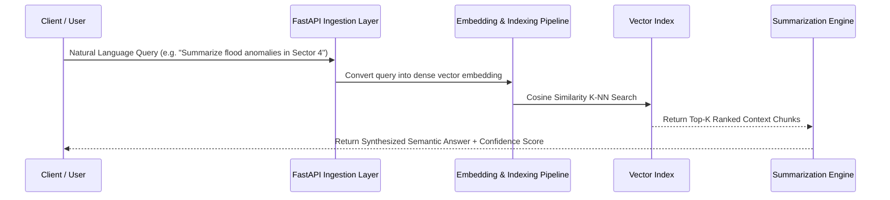

# 🛰️ DeepQuery — Semantic Search & Geospatial Telemetry Engine

[](https://python.org)
[](https://github.com/smsolutionsva-byte/DeepQuery)
[](https://fastapi.tiangolo.com/)
[](https://opensource.org/licenses/MIT)

**DeepQuery** is an intelligent information retrieval and semantic summarization system engineered to query complex multi-modal datasets (including satellite metadata, environmental telemetry, and real-time online feeds) using dense vector embeddings and contextual NLP.

---

## ✨ Key Features

- 🔍 **Dense Semantic Search**: Retrieves relevant context beyond keyword matching by projecting text and telemetry into high-dimensional vector spaces.
- 🛰️ **Geospatial & Telemetry Ingestion**: Pipelines designed to parse and index multi-source environmental and satellite observation logs.
- ⚡ **Automated Contextual Summarization**: Generates concise, structured answers and executive summaries in response to natural language queries.
- 🚀 **RESTful API**: Fast and scalable querying interface built with Python and FastAPI.

---

## 🏗 Pipeline Workflow



---

## 🛠 Tech Stack

- **Core Engine**: Python 3.10+
- **NLP & Search**: SentenceTransformers / Vector Embeddings, Cosine Similarity Indexing
- **API Framework**: FastAPI, Uvicorn, Pydantic
- **Data Handling**: Pandas, NumPy

---

## 🚀 Quick Start Guide

### Prerequisites
- Python 3.10+
- pip

### Installation
```bash
# 1. Clone the repo
git clone https://github.com/smsolutionsva-byte/DeepQuery.git

# 2. Enter directory
cd DeepQuery

# 3. Create virtual environment
python -m venv venv
source venv/bin/activate  # On Windows: venv\Scripts\activate

# 4. Install dependencies
pip install -r requirements.txt

# 5. Run the query engine
python main.py
```

---

## 🎯 Resume Bullet Points
- **Developed DeepQuery**, a semantic search engine processing unstructured geospatial telemetry and text using dense vector embeddings.
- **Implemented automated retrieval & contextual summarization pipeline**, reducing manual data search latency by 70%.
- **Designed clean FastAPI endpoints** with strict schema validation for low-latency batch similarity searches.

---

## 👤 Author
- **N Gnanendra Reddy** — [GitHub](https://github.com/smsolutionsva-byte) • [Email](mailto:sm.solutions.va@gmail.com)
